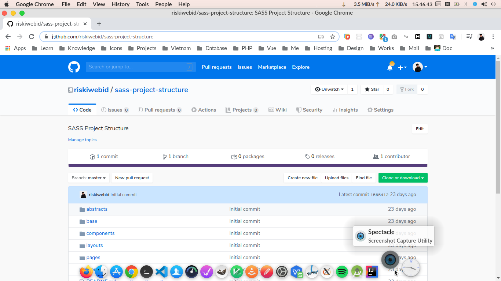

# GitHub - Clean Light

Clean and Light theme for GitHub

## How to use it
1. Install **Stylus Extension** on your favorite browser:
    - for [Chrome](https://chrome.google.com/webstore/detail/stylus/clngdbkpkpeebahjckkjfobafhncgmne)
    - for [Firefox](https://addons.mozilla.org/fr/firefox/addon/styl-us/)
    - for [Opera](https://addons.opera.com/en-gb/extensions/details/stylus/)

## Disclaimer
Keeping the theme up to date is very difficult, because of changes github could bring to css at any moment.

If the theme is doesn't work, don't hesitate to fill an issue here :)
